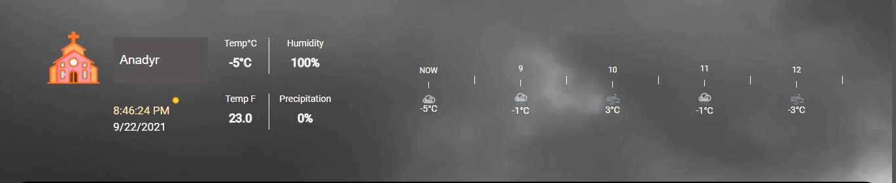
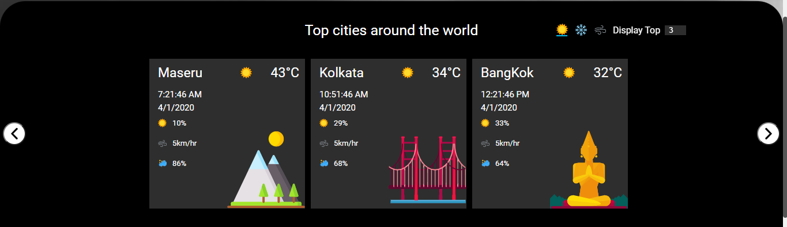
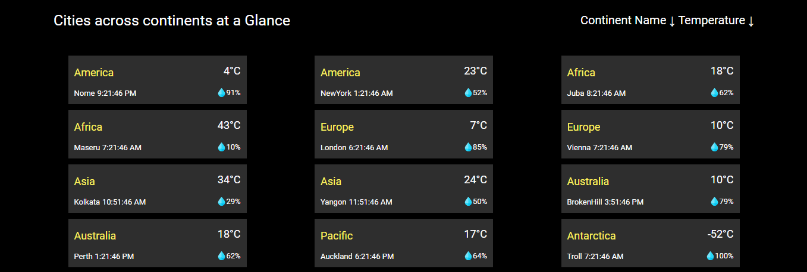

# WEATHER APPLICATION

It is a weather forecasting application to represent the weather and other climatic conditions of different cities. This web application is developed using HTML, CSS, JAVASCRIPT, NODE.js and Express.js
The application consists of three sections top, middle, bottom.

---

## TOP SECTION - Weather Information of The selected city

A city is selected from the drop down button and information such as temperature in celcius, temperature in fahrenheit, humidity and precipitation is displayed along with the temperature of the city for the next 5 hours.


---

## MIDDLE SECTION - Weather conditions for the list of city

The list of the city cards are displayed based on the user clicking the icon sunny, windy and snowy. The number of city cards be displayed using the spinner input.


---

## BOTTOM SECTION - Continent wise weather condition for the list of city.

The list of cities will be displayed by sorting based on the continent names and temperature.


---

## REQUIREMENTS

Modules required are

-   npm
-   express

```
npm install express --save
```

-   axios

```
 npm install axios --save
```

-   nodemon

```
 npm install -g nodemon --save
```

-   cors

```
npm install cors --save
```

-   body-parser

```
npm install body-parser
```

---

## INSTALLATIONS

Use this [link] (https://nodejs.org/en/download/) to install node

## TO RUN THE node_http.js File

```
cd public
node node_http.js
```

## TO RUN THE node_http.js File

```
node node_express.js
```

## HOST URL

http://localhost:8000/
